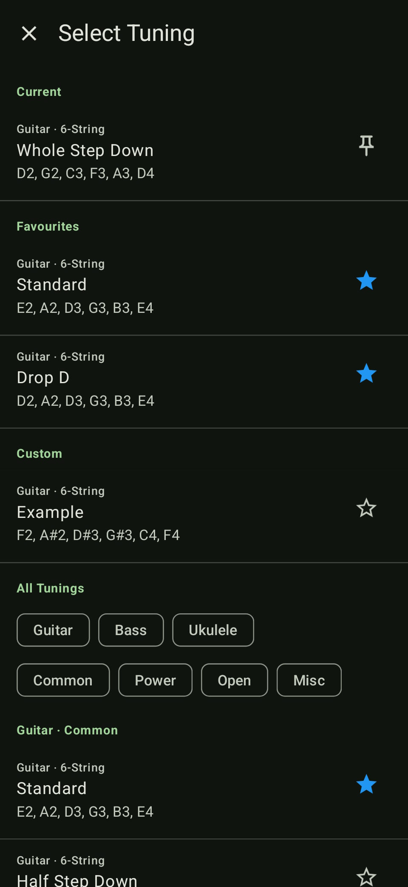
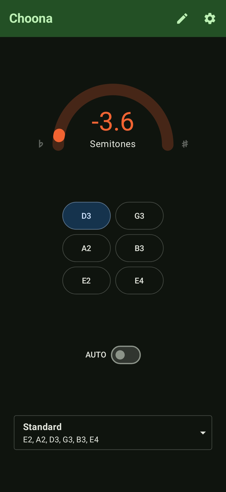
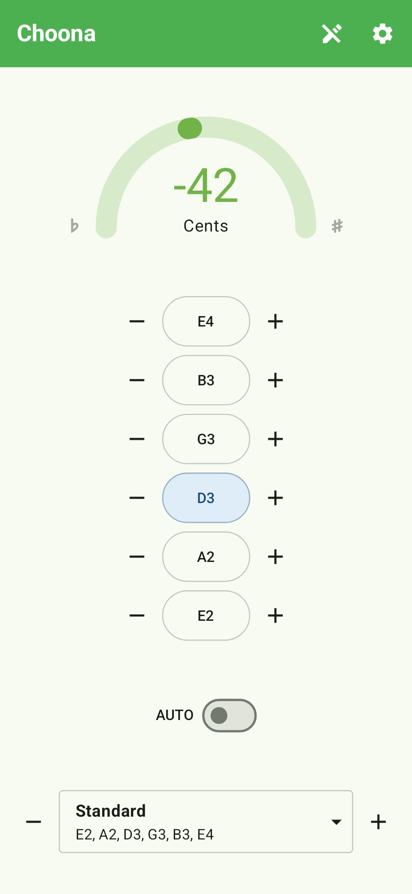

# Choona - Guitar Tuner
Guitar tuner application for Android with support for custom tunings.

**Author:** Rohan Khayech

## Features
- Listens as you play a string and indicates whether it is in-tune.
- Displays the amount to tune each string up/down to reach the correct pitch.
- Automatic detection of which string is playing.
- Choose from 20+ common guitar and bass tunings.
- Save and tune to custom tunings with any combination of strings.
- Display tuning offset in semitones or cents for improved accuracy.
- Plays sounds to indicate how a string should sound and when it is in tune.
- Keep track of your favourite tunings.
- Support for dark mode and includes true dark theme.
- Support for multi-window and large screen devices.

## Screenshots

 

  

    View All
  

   
    
   

    
   
  
   

## Installation
Choona is available for Android devices running Android 7.0 Nougat and above.

1. Find the latest release [here](https://github.com/rohankhayech/Choona/releases/latest).
2. Download the `.apk` file onto your Android device.
3. Open the downloaded file and follow the prompts to install the app.

> Depending on your device, you may have to enable installing apps from unknown sources for your device or browser app in your phone's settings.

## License and Copyright
Copyright © 2023 Rohan Khayech

Choona is licensed under the GNU General Public License v3.0.
See [LICENSE](LICENSE) for the full license terms.

See [NOTICES](NOTICES.md) to view the list of notices for the third-party software used or included in this application.
